***

### 服务器安装

​    Docker 首选安装在Linux系统上，（有钱的大佬可以直接在阿里云买服务器，可以省略这个步骤）

​    开始为了偷懒在 win7上安装了DockerToolbox（win10安装Docker for Windows），结果后续在和web程序结合的时候出现一大堆问题。所以建议安装VirtualBox 创建虚拟机安装Linux系统(推荐CenterOS7内核)

​    在VirtualBox 安装好CenterOS7后，这里有个注意的点就是需要设置**双网卡**（实现虚拟机可以访问外网，宿主机可以访问虚拟机）

​    全局设定

​                                          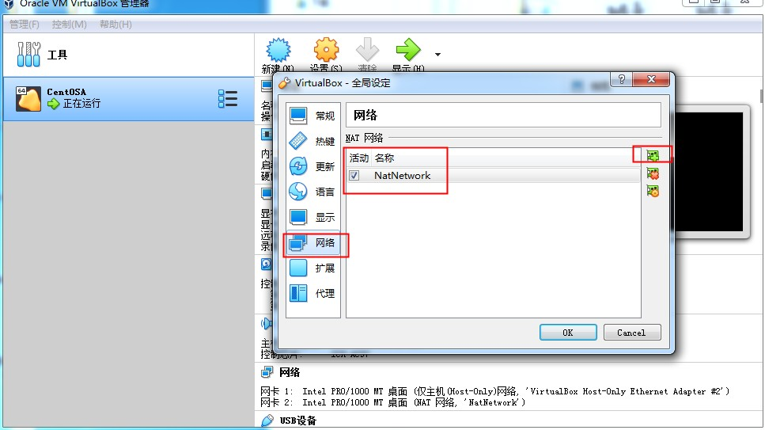

​     接着设置虚拟机使用双网卡

​                                             网卡1

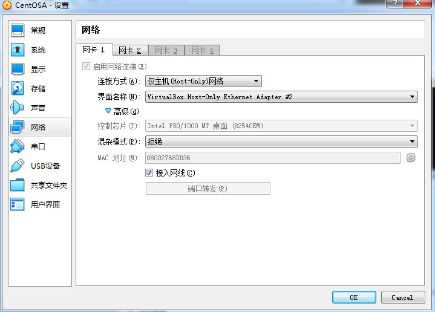

​                                             网卡2

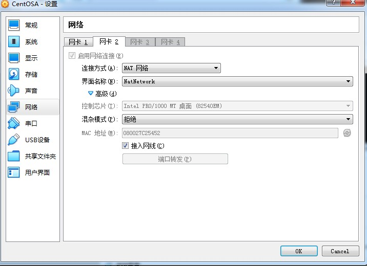

root账户进入虚拟机,先看能不能访问外网

```
ping www.baidu.com
```

正常显示，可以ping通

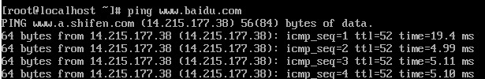

查看那网卡信息

```
ifconfig
```

如果出现

```
ifconfig command not found---说明没有安装
接着执行
yum install net-tools
```

没问题，会显示网卡信息

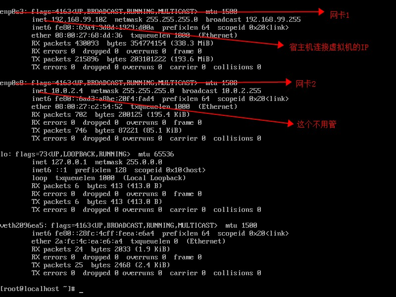

使用ssh工具连接 192.168.99.102 端口 22 就可以连上了 (**192.168.99.102这个是虚拟机外网IP，每个人的不一样**)

完成到这一步，虚拟机就搭建完成了。

安装Docker以及镜像加速，参考阿里巴巴的官方文档：https://help.aliyun.com/document_detail/51853.html?spm=a2c4g.11186623.6.820.RaToNY

### Docker常用命令

```

docker images---查看镜像

docker ps  ---查看容器

history |grep docker  --查看docker  历史操作

docker pull ${images}  --拉取镜像

docker rmi ${images} --删除镜像

docker exec -it  ${containerName} /bin/bash --进入容器  

docker run -d -p port:port -v {挂载目录} --name {容器名字} ${REPOSITORY}:${TAG} ---启动镜像到容器

docker run -d -p 8080:8080 -p 50000:50000 -v jenkins_home:/var/jenkins_home --name jenkins  jenkins/jenkins:latest  --jenkins为例

docker stop ${containerName}  --暂停容器

docker start ${containerName}  --启动容器

docker rm ${containerName}  --删除容器

docker logs -f --tail=200 jenkins  --日志

docker volume ls   --所有挂载卷

docker cp -a  ${containerName}:${containerDir}  ${hostDir}    ---复制容器文件到宿主机

```

### IntelliJ IDEA  中Docker 的使用

 目前IDEA2019后版本默认都带了Docker插件，如果没有，自行安装插件

###### 介绍两种连接方式

  *tcp方式连接*

打开虚拟机

```
vi /lib/systemd/system/docker.service

修改其中改的 ExecStart=/usr/bin/dockerd-current 这一行 在后面加上 -H unix:///var/run/docker.sock  -H tcp://0.0.0.0:2375 
完整文件：
[Unit]
Description=Docker Application Container Engine
Documentation=http://docs.docker.com
After=network.target
Wants=docker-storage-setup.service
Requires=docker-cleanup.timer

[Service]
Type=notify
NotifyAccess=main
EnvironmentFile=-/run/containers/registries.conf
EnvironmentFile=-/etc/sysconfig/docker
EnvironmentFile=-/etc/sysconfig/docker-storage
EnvironmentFile=-/etc/sysconfig/docker-network
Environment=GOTRACEBACK=crash
Environment=DOCKER_HTTP_HOST_COMPAT=1
Environment=PATH=/usr/libexec/docker:/usr/bin:/usr/sbin
ExecStart=/usr/bin/dockerd-current -H unix:///var/run/docker.sock  -H tcp://0.0.0.0:2375 \
          --add-runtime docker-runc=/usr/libexec/docker/docker-runc-current \
          --default-runtime=docker-runc \
          --exec-opt native.cgroupdriver=systemd \
          --userland-proxy-path=/usr/libexec/docker/docker-proxy-current \
          --init-path=/usr/libexec/docker/docker-init-current \
          --seccomp-profile=/etc/docker/seccomp.json \
          $OPTIONS \
          $DOCKER_STORAGE_OPTIONS \
          $DOCKER_NETWORK_OPTIONS \
          $ADD_REGISTRY \
          $BLOCK_REGISTRY \
          $INSECURE_REGISTRY \
          $REGISTRIES
ExecReload=/bin/kill -s HUP $MAINPID
LimitNOFILE=1048576
LimitNPROC=1048576
LimitCORE=infinity
TimeoutStartSec=0
Restart=on-abnormal
KillMode=process

[Install]
WantedBy=multi-user.target
~                               

```

修改完成后,执行

```
ps -ef | grep docker    --查看端口是否成功 
```

正常

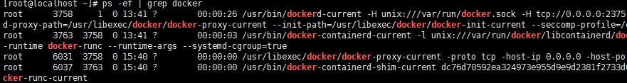

继续

```
systemctl daemon-reload && systemctl restart docker  --重载docker配置
firewall-cmd --zone=public --add-port=2375/tcp --permanent -打开2375端口防火墙
firewall-cmd --reload    ---重载防火墙
firewall-cmd --zone=public --list-ports  --查看所有开放的端口
```

这个时候可以telnet下这个端口通不通，如果通了，在idea中连接上了

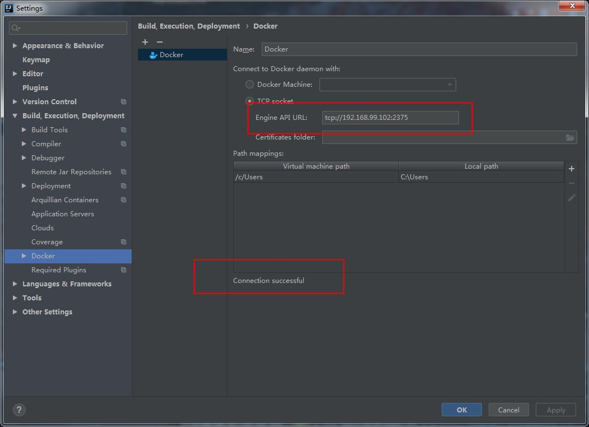

###### ***https方式连接***

​    这种方式虽然复杂点，但是能保证数据安全

先生成服务器tls证书

```
cd /
mkdir tls
cd tls
openssl genrsa -aes256 -out ca-key.pem 4096   --输入的密码要记住，后面会用到

openssl req -new -x509 -days 365 -key ca-key.pem -sha256 -out ca.pem   --随意填写

openssl genrsa -out server-key.pem 4096  --执行生成服务器端key证书文件

openssl req -subj "/CN=192.168.99.102" -sha256 -new -key server-key.pem -out server.csr  --192.168.99.102 是上文提到的虚拟机外网IP

echo subjectAltName = IP:192.168.99.102,IP:0.0.0.0 >> extfile.cnf  ---配置白名单

echo extendedKeyUsage = serverAuth >> extfile.cnf     --只能用在服务器认证

openssl x509 -req -days 365 -sha256 -in server.csr -CA ca.pem -CAkey ca-key.pem \-CAcreateserial -out server-cert.pem -extfile extfile.cnf             ---输入之前设置的密码，然后会生成签名的证书

openssl genrsa -out key.pem 4096  --生成idea等客户端需要用到的密钥文件

openssl req -subj '/CN=client' -new -key key.pem -out client.csr   --生成客户端签名请求需要用到的临时文件

echo extendedKeyUsage = clientAuth >> extfile.cnf

openssl x509 -req -days 365 -sha256 -in client.csr -CA ca.pem -CAkey ca-key.pem \-CAcreateserial -out cert.pem -extfile extfile.cnf  --输入之前的密码生成认证证书，生成正式签名证书

rm -rf client.csr server.csr 删除生成的临时文件

chmod -v 0400 ca-key.pem key.pem server-key.pem    --修改证书为只读权限保证证书安全

chmod -v 0444 ca.pem server-cert.pem cert.pem   --修改证书为只读权限保证证书安全

cp server-cert.pem ca.pem server-key.pem /etc/docker/  --复制服务端需要用到的证书到docker配置目录下便于识别使用

修改配置
vi /lib/systemd/system/docker.service
也是修改
ExecStart=/usr/bin/dockerd-current 这一行 后面加上 
-H unix:///var/run/docker.sock  -H tcp://0.0.0.0:2375 --tlsverify --tlscacert=/etc/docker/ca.pem --tlscert=/etc/docker/server-cert.pem --tlskey=/etc/docker/server-key.pem 

完整配置
[Unit]
Description=Docker Application Container Engine
Documentation=http://docs.docker.com
After=network.target
Wants=docker-storage-setup.service
Requires=docker-cleanup.timer

[Service]
Type=notify
NotifyAccess=main
EnvironmentFile=-/run/containers/registries.conf
EnvironmentFile=-/etc/sysconfig/docker
EnvironmentFile=-/etc/sysconfig/docker-storage
EnvironmentFile=-/etc/sysconfig/docker-network
Environment=GOTRACEBACK=crash
Environment=DOCKER_HTTP_HOST_COMPAT=1
Environment=PATH=/usr/libexec/docker:/usr/bin:/usr/sbin
ExecStart=/usr/bin/dockerd-current -H unix:///var/run/docker.sock  -H tcp://0.0.0.0:2376 --tlsverify --tlscacert=/etc/docker/ca.pem --tlscert=/etc/docker/server-cert.pem --tlskey=/etc/docker/server-key.pem \
          --add-runtime docker-runc=/usr/libexec/docker/docker-runc-current \
          --default-runtime=docker-runc \
          --exec-opt native.cgroupdriver=systemd \
          --userland-proxy-path=/usr/libexec/docker/docker-proxy-current \
          --init-path=/usr/libexec/docker/docker-init-current \
          --seccomp-profile=/etc/docker/seccomp.json \
          $OPTIONS \
          $DOCKER_STORAGE_OPTIONS \
          $DOCKER_NETWORK_OPTIONS \
          $ADD_REGISTRY \
          $BLOCK_REGISTRY \
          $INSECURE_REGISTRY \
          $REGISTRIES
ExecReload=/bin/kill -s HUP $MAINPID
LimitNOFILE=1048576
LimitNPROC=1048576
LimitCORE=infinity
TimeoutStartSec=0
Restart=on-abnormal
KillMode=process

[Install]
WantedBy=multi-user.target


```

配置完

```
systemctl daemon-reload && systemctl restart docker  --重载docker配置
```

把/etc/docker/中的三个文件保存到本地,后面IDEA连接会用到

```
ca.pem    cert.pem  key.pem
```

最后,IDEA设置

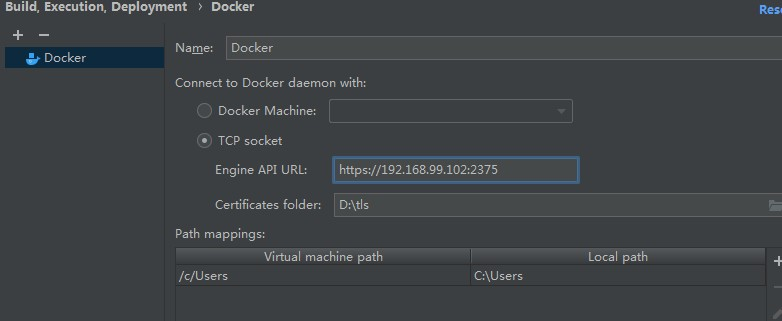

IDEA新建Springboot  web项目

```java
@SpringBootApplication
@RestController
public class DockerDemoApplication {

    public static void main(String[] args) {
        SpringApplication.run(DockerDemoApplication.class, args);
    }


    @GetMapping("welcome")
    public Object testController() {
        return "welcome";
    }
}
```

新建Dockerfile文件(Dockerfile这个文件名称不要乱改，改了会出错)

```
FROM openjdk:8-jdk-alpine
VOLUME /tmp
ARG JAR_FILE
COPY ${JAR_FILE} app.jar
ENTRYPOINT ["java","-jar","/app.jar"]

参数讲解：
FROM <image>:<tag> 需要一个基础镜像，可以是公共的或者是私有的， 后续构建会基于此镜像，如果同一个Dockerfile中建立多个镜像时，可以使用多个FROM指令	VOLUME  配置一个具有持久化功能的目录，主机 /var/lib/docker 目录下创建了一个临时文件，并链接到容器的/tmp。改步骤是可选的，如果涉及到文件系统的应用就很有必要了。
/tmp目录用来持久化到 Docker 数据文件夹，因为 Spring Boot 使用的内嵌 Tomcat 容器默认使用/tmp作为工作目录 
ARG  设置编译镜像时加入的参数， ENV 是设置容器的环境变量
COPY : 只支持将本地文件复制到容器 ,还有个ADD更强大但复杂点
ENTRYPOINT 容器启动时执行的命令
EXPOSE 8080 暴露镜像端口
```

项目结构

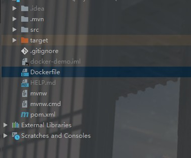

修改pom.xml

```xml
<?xml version="1.0" encoding="UTF-8"?>
<project xmlns="http://maven.apache.org/POM/4.0.0" xmlns:xsi="http://www.w3.org/2001/XMLSchema-instance"
         xsi:schemaLocation="http://maven.apache.org/POM/4.0.0 https://maven.apache.org/xsd/maven-4.0.0.xsd">
    <modelVersion>4.0.0</modelVersion>
    <parent>
        <groupId>org.springframework.boot</groupId>
        <artifactId>spring-boot-starter-parent</artifactId>
        <version>2.3.2.RELEASE</version>
        <relativePath/> <!-- lookup parent from repository -->
    </parent>
    <groupId>com.example</groupId>
    <artifactId>docker-demo</artifactId>
    <version>0.0.1-SNAPSHOT</version>
    <name>docker-demo</name>
    <description>Demo project for Spring Boot</description>

    <properties>
        <java.version>1.8</java.version>
        <docker.image.prefix>docker</docker.image.prefix>
    </properties>

    <dependencies>
        <dependency>
            <groupId>org.springframework.boot</groupId>
            <artifactId>spring-boot-starter-web</artifactId>
        </dependency>

        <dependency>
            <groupId>org.springframework.boot</groupId>
            <artifactId>spring-boot-starter-test</artifactId>
            <scope>test</scope>
            <exclusions>
                <exclusion>
                    <groupId>org.junit.vintage</groupId>
                    <artifactId>junit-vintage-engine</artifactId>
                </exclusion>
            </exclusions>
        </dependency>
    </dependencies>

    <build>
        <finalName>docker-demo</finalName>
        <plugins>
            <plugin>
                <groupId>org.springframework.boot</groupId>
                <artifactId>spring-boot-maven-plugin</artifactId>
            </plugin>
             <!-- Docker maven plugin -->
            <plugin>
                <groupId>com.spotify</groupId>
                <artifactId>dockerfile-maven-plugin</artifactId>
                <version>1.3.6</version>
                <configuration>
                    <repository>${docker.image.prefix}/${project.artifactId}</repository>
                    <buildArgs>
                        <JAR_FILE>target/${project.build.finalName}.jar</JAR_FILE>
                    </buildArgs>
                </configuration>
            </plugin>
            <!--maven 打包时跳过Test -->
            <plugin>
                <artifactId>maven-surefire-plugin</artifactId>
                <configuration>
                    <skipTests>true</skipTests>
                </configuration>
            </plugin>
        </plugins>
    </build>

</project>

```

在Terminal中输入

```
mvn install dockerfile:build    ---maven 构造镜像
```

构造成功

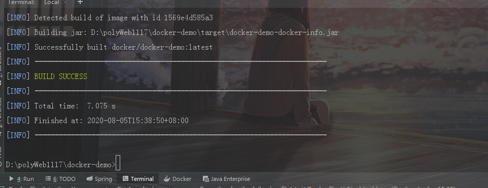

查看docker,镜像已经推送到服务器docker

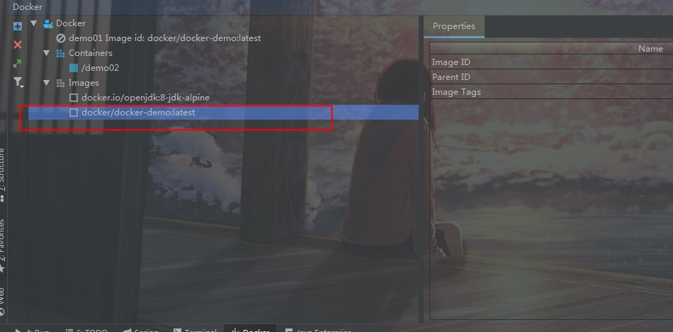

右键镜像创造容器

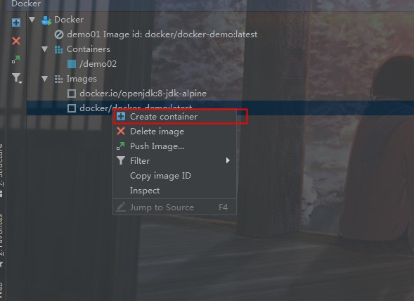

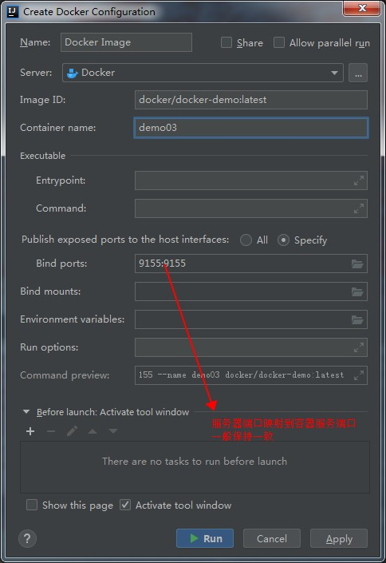

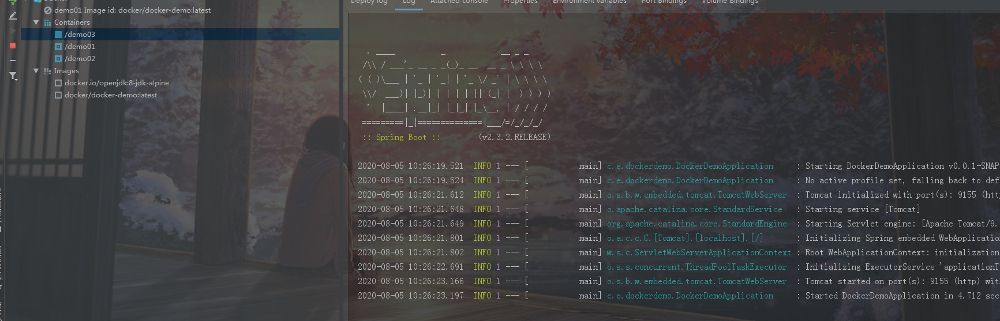

构造docker容器成功，不要忘记开放服务器防火墙

```
firewall-cmd --zone=public --add-port=9155/tcp --permanent
firewall-cmd --reload
```

post测试访问成功

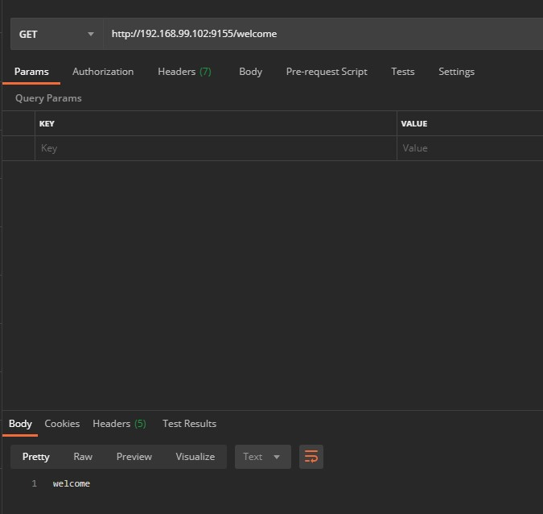


### Ngnix

```
docker run -d -p 80:80 -v /etc/nginx/nginx.conf:/etc/nginx/nginx.conf --name nginx  docker.io/nginx:latest
```

### consul

```
docker pull consul

docker run --name consul -d -p 8500:8500 consul
```

### gitlab

```
https://www.jianshu.com/p/080a962c35b6
# gitlab-ce为稳定版本，后面不填写版本则默认pull最新latest版本
 docker pull gitlab/gitlab-ce
 
 docker run -d  -p 443:443 -p 80:80 -p 222:22 --privileged=true --name gitlab --restart always -v /data/gitlab/config:/etc/gitlab -v /data/gitlab/logs:/var/log/gitlab -v /data/gitlab/data:/var/opt/gitlab gitlab/gitlab-ce
 
# gitlab.rb文件内容默认全是注释
$ vim /home/gitlab/config/gitlab.rb
 
# 配置http协议所使用的访问地址,不加端口号默认为80
external_url 'http://10.0.2.15'
# 配置ssh协议所使用的访问地址和端口
gitlab_rails['gitlab_ssh_host'] = '10.0.2.15'
# 此端口是run时22端口映射的222端口
gitlab_rails['gitlab_shell_ssh_port'] = 222 

```


### Jenkins

```
docker pull jenkins/jenkins:lts

chown -R 1000:1000 /data/jenkins/jenkins_home   --修改权限为 1000

docker run -d -p 8888:8080 -p 50000:50000 --privileged=true  -v /data/jenkins/jenkins_home:/var/jenkins_home  -v /etc/localtime:/etc/localtime  --name jenkins  jenkins/jenkins:lts

--privileged=true 在CentOS7中的安全模块selinux把权限禁掉了，参数给容器加特权

镜像地址
https://mirrors.tuna.tsinghua.edu.cn/jenkins/updates/update-center.json


```

